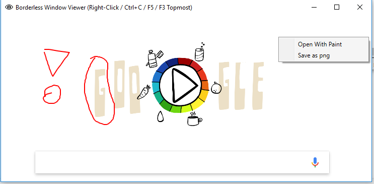

# Borderless Graphic Viewer
Used to display an image within a minimal frame.
Keeps the window topmost by default. Avoids having to switch windows/tabs often. Simply take a snapshot of an area of interest and let this tool take care of keeping it in your view.

## Controls
- **Left mouse button:** draw
- **CTRL+C:** Saves current image to the clipboard
- **CTRL+Z:** Undos last drawing action
- **F3:** Toggles windows topmost state
- **F5:** Removes the drawing
- **Right mouse button:** Opens the context menu
	- Open with Paint
	- Save as PNG
- Resize with **shift** to keep the original aspect ratio

## Usage with Greenshot

Right click Greenshots tray icon -> Configure external commands -> new

Fill in the data:

*Name:* BorderlessGraphicViewer

*Command:* <path/to/BorderlessGraphicViewer.exe>

*Argument:* "{0}"

Then you need to choose BorderlessGraphicViewer as the target:

Right click tray icon -> Settings -> Targets --> BorderlessGraphicViewer

## General usage

Pass the path to an image as the first argument.

